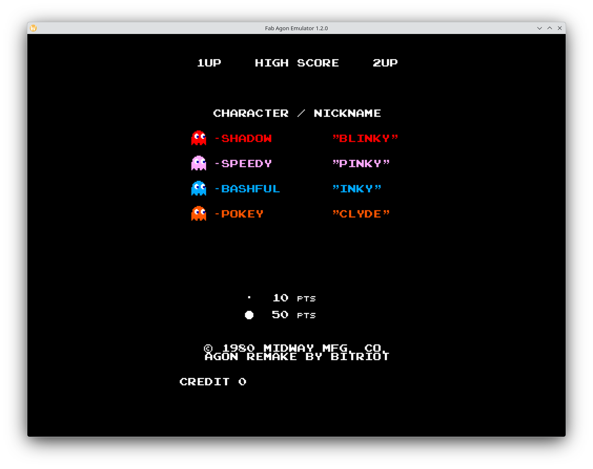
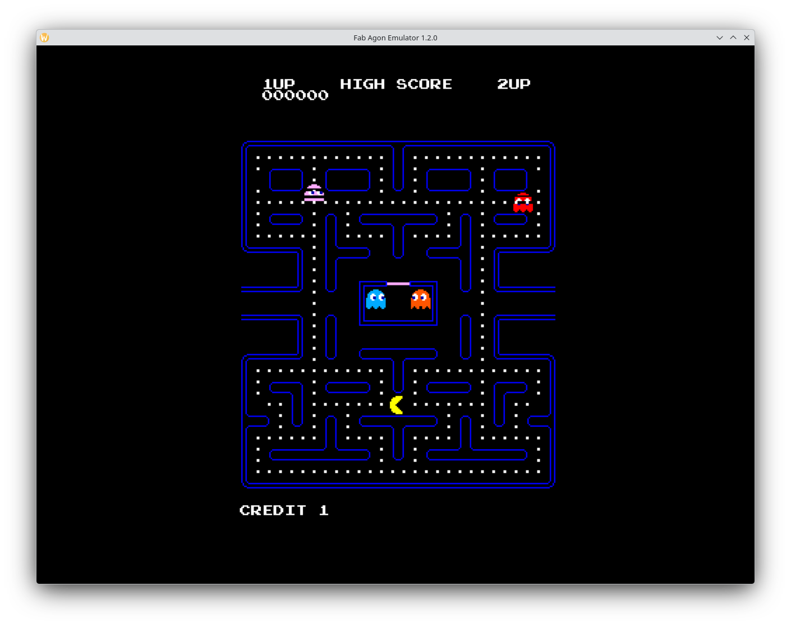

# Pac-Man (Agon Light 2)

[](https://github.com/andymccall/pac-man/actions/workflows/build.yml)
[](https://github.com/andymccall/pac-man/actions/workflows/docker.yml)
[](https://github.com/andymccall/pac-man/actions/workflows/lint.yml)



An arcade-faithful eZ80-ADL port of the 1980 Midway / Namco *Pac-Man* to the [Agon Light 2](https://www.thebyteattic.com/p/agon.html). The aim is to match the original arcade behaviour pixel- and frame-accurately wherever the platform allows — ghost AI, score popups, fright + white-flash visuals, ghost-house release timing, eaten-ghost eyes-return, custom font extracted from the arcade sprite sheet — while running natively in Agon's VDU mode 20 (512×384, 64-colour).

This is a **non-commercial fan port** for retro / homebrew use. Pac-Man is © Bandai Namco Entertainment Inc. and Midway Manufacturing Co. (1980). No assets are redistributed from the original ROM; the bitmaps in this repo were re-authored or extracted from a publicly-circulated sprite sheet in `reference/` for educational reference only.

## Gameplay



## Key features

- **Faithful ghost AI** — Blinky chase / Pinky 4-tiles-ahead with the famous up-direction overflow bug / Inky pivot-and-mirror across Blinky / Clyde distance-threshold, all using signed 8-bit pathfinding so the bugs work the way the 1980 ROM intends.
- **Frightened-mode visuals** — blue ghost frames during fright; white-flash warning in the last ~2 s before timeout.
- **Eaten-ghost eyes-return** — eyes pathfind back to the pen door, descend through the gate, and re-emerge as a normal ghost.
- **Ghost-house release timing** — Pinky / Inky / Clyde wait inside the pen for the pellet-counter thresholds (0 / 30 / 60) before exiting one by one.
- **Score popups** — 200 / 400 / 800 / 1600 sprite plotted at the eaten ghost's position, sampled directly from the arcade sprite sheet.
- **Arcade font + banners** — the in-game digits, alphabet, and READY! / GAME OVER banners are extracted glyph-by-glyph from the arcade sprite sheet (with per-pixel placement so they sit cleanly inside the maze lanes).
- **Power-pellet blink, fruit spawning at 70 / 170 pellets, bonus life at 10 000 points, pen gate, pellet-map reset on new game** — all wired up.

Controls are keyboard today; the [EIGHTSBITWIDE Arcade board](https://andymccall.co.uk/electronics/retrocomputing/agon/basic/2024/07/09/agon-light-2-arcade-controller-board.html) wiring is on the roadmap.

## Status

| Area | Status |
|---|---|
| Pac-Man movement (tile-aligned, cornering, tunnel wrap) | ✅ |
| Ghost AI (chase / scatter / fright / eyes-return) | ✅ |
| Tunnel slow-down + no-up tiles (arcade quirks) | ✅ |
| Power pellets, fright, blink, score chain | ✅ |
| Eaten-ghost freeze (1 s pause with score popup) | ✅ |
| Fruit spawning (cherry only) | ✅ |
| Custom arcade font, banners, score popups | ✅ |
| Arcade-faithful attract sequence (staggered reveal + title screen) | ✅ |
| Level progression on maze clear | ✅ |
| Sound | ❌ (issue #10) |
| Attract demo gameplay (AI Pac) | ❌ (issue #11) |
| Title-screen chase animation | ❌ (issue #39) |
| Maze-flash on level clear | ✅ |
| Per-level scatter timings / Pac speed / fruit type / Cruise Elroy | ❌ (issues #16, #17, #22, #24) |
| Intermission cutscenes | ❌ (issue #13) |
| High score persistence + table | ❌ (issues #29, #30) |

Full backlog: [open issues](https://github.com/andymccall/pac-man/issues).

## Supported platform

| Platform | CPU | Assembler | Output | Display |
|---|---|---|---|---|
| Agon Light 2 | eZ80 ADL | `ez80asm` | `bin/pac-man.bin` | VDU mode 20 — 512×384 @ 64 colours, 60 Hz |

The arcade screen is 28×31 tiles (224×248 px). Mode 20 gives us a 64×48 tile grid, so the 1:1 arcade maze fits with margins; the side margins host the HUD.

## Prerequisites

| Tool | Purpose |
|---|---|
| [ez80asm](https://github.com/AgonPlatform/agon-ez80asm) | eZ80 assembler — produces the `.bin` |
| `make` | Build driver |
| Python 3 + [Pillow](https://pillow.readthedocs.io/) | Asset extraction scripts (one-shot — bitmaps are already in `src/assets/`) |
| [fab-agon-emulator](https://github.com/tomm/fab-agon-emulator) | Emulator for the `make run` target |

Don't want to install the toolchain on your host? The `Dockerfile` packages `ez80asm` + Python/Pillow + `make` into one image. The same image is published to GHCR as `ghcr.io/andymccall/pac-man-builder:latest` by [`.github/workflows/docker.yml`](.github/workflows/docker.yml) on Dockerfile changes — that's also what [`.github/workflows/build.yml`](.github/workflows/build.yml) pulls when CI builds the binary on every push + PR.

## Building

```sh
make           # build bin/pac-man.bin
make clean     # wipe bin/ and release/
make package   # bundle pac-man-<git-describe>.zip into release/
make run       # launch fab-agon-emulator on the bin/ folder
```

### Containerised build

```sh
# Pull the published toolchain image and build
docker pull ghcr.io/andymccall/pac-man-builder:latest
docker run --rm -v "$PWD:/work" -w /work \
    --user "$(id -u):$(id -g)" \
    ghcr.io/andymccall/pac-man-builder:latest \
    make
```

The `--user` flag keeps the produced `bin/pac-man.bin` owned by your host user rather than `root`.

## Releases

Tag a release with `git tag v1.x.x && git push --tags` and [`.github/workflows/release.yml`](.github/workflows/release.yml) builds + publishes a GitHub Release with `pac-man-v1.x.x-agon.zip` (binary + README) attached and auto-generated changelog notes from the tag-to-tag commit history.

Pre-release tags (`v1.0.0-rc.1`, `v1.0.0-beta.1`) are auto-flagged as pre-releases on GitHub.

## Project structure

```
pac-man/
├── docs/
│   └── images/                         # README screenshots
├── reference/
│   ├── pac-man.asm                     # Disassembled arcade Z80 ROM (read-only ref)
│   ├── sprite_sheet.png                # Sprite sheet — font / score popups / fruit /
│   └── sprite_sheet_rotated.png        #   ghost frames extracted from here
├── src/
│   ├── pac-man.asm                     # Top-level entry — MOS header, includes,
│   │                                   # start: + main_loop:
│   ├── assets/                         # Pre-rendered RGBA2 bitmaps
│   │   ├── banner/                     #   READY! / GAME OVER / erase
│   │   ├── font/                       #   arcade.1bpp (1 bpp, 256 chars × 8 bytes)
│   │   ├── fruit/                      #   cherry / strawberry / orange / …
│   │   ├── ghosts/                     #   blinky / pinky / inky / clyde / reverse
│   │   ├── maze/                       #   34 wall tiles + gate
│   │   ├── pac_man/                    #   movement frames + 11-frame death
│   │   ├── pellet/                     #   pellet / power pellet / erase
│   │   ├── score/                      #   200 / 400 / 800 / 1600 popups
│   │   └── splash/                     #   bitriot attract logo
│   └── includes/
│       ├── api/                        #   VDP / MOS thin wrappers (vdu_sprite_*,
│       │                               #   vdu_bitmap_plot, vdu_text_*, macro_*)
│       ├── system/                     #   MOS RST table, stack macros
│       └── game/                       #   Game logic — see below
├── .github/
│   ├── workflows/                      # build / docker / release / size-delta / lint
│   └── dependabot.yml                  # Weekly GHA action updates
├── bin/                                # Build output (gitignored)
├── release/                            # `make package` output (gitignored)
├── Dockerfile                          # Toolchain image (ez80asm + Python/Pillow)
└── Makefile
```

The `src/includes/game/` tree holds the actual game logic — one file per system: `pac_move.inc`, `ghost_ai.inc`, `pellet_eat.inc`, `fruit.inc`, `lives.inc`, `level.inc`, `font.inc`, `collision.inc`, `state.inc`, plus the per-state files under `states/` and the sprite-id definitions under `sprites/`.

## Architecture at a glance

- **Single binary**, eZ80 ADL mode (`.assume adl=1`), origin `$040000`. MOS loads the binary into RAM and jumps to `start`.
- **State machine** in [src/includes/game/state.inc](src/includes/game/state.inc): one `GS_*` ID per major screen (`GS_ATTRACT_SPLASH`, `GS_ATTRACT_CHARS`, `GS_READY`, `GS_PLAY`, `GS_DYING`, `GS_GAME_OVER`, …). Each state defines `state_<name>_enter` (called once on entry) and `state_<name>_tick` (called every vblank). `game_state_set` flips the state; `game_state_tick` dispatches.
- **Main loop** in [src/pac-man.asm](src/pac-man.asm) is just `game_timer_tick` → `game_state_tick` → ESC check → `vdu_vblank` → `vdu_refresh`. The game ticks at the VDP's 60 Hz vblank.
- **Sprites + bitmaps** ride on the Agon VDP's sprite + bitmap-buffer system. Sprite slot 0 is Pac, slots 1-4 are ghosts, 5 is the (attract-mode) reverse-ghost demo, 6-13 are the fruit slots, 14 is the lives icon, 15 is the score popup. Bitmap buffers carry the maze tiles (400-435), pellets (440-443), score popups (340-343), banners (110-112), and the custom font (100). The full buffer-id map lives in the includes under `sprites/`.
- **Custom font** is uploaded at boot via the VDP Font API (`VDU 23, 0, 0xA0` write + `0x95` create + select). The font glyphs were extracted from `reference/sprite_sheet.png` directly. See [src/includes/game/font.inc](src/includes/game/font.inc); note the **consolidate** step — the VDP rejects multi-block buffers as font sources, so we issue a `VDU 23, 0, 0xA0, id, 14` to merge the upload into a single block before the create command.

A proper wiki with diagrams and per-system walk-throughs is on the roadmap (issue #33).

## Asset pipeline

Most bitmaps in `src/assets/` were one-shot extracted from `reference/sprite_sheet.png` using small Python scripts. The extractors aren't part of the build (the bitmaps live in-tree as `.rgba2` files alongside their sprite-id includes), but the technique is documented inline and in the project's CLAUDE-memory notes for reproducibility:

- **Font** (`src/assets/font/arcade.1bpp`) — 256 chars × 8 rows of 1-bit-packed glyphs. Digits 0-9 and uppercase A-Z extracted from the sheet's font block with a per-glyph 90° rotation (the source stores them rotated CW). Plus hand-drawn `!` and `.`, opening / closing quotes at codepoints 147 / 148, `©` at 169.
- **Score popups** (`src/assets/score/`) — 16×8 RGBA2 bitmaps for 200 / 400 / 800 / 1600, extracted from the rotated sprite sheet and packed in cyan (`0xFC`).
- **Banners** (`src/assets/banner/`) — `READY!` (yellow) and `GAME OVER` (red) rendered from the arcade font into RGBA2 bitmaps, plus a black `READY!` eraser. Pre-rendered rather than printed via VDU 5 / PLOT MOVE because the text-grid only steps in 8-px rows but the banners need to sit mid-lane.
- **Gate tile** (`src/assets/maze/tile_35.rgba2`) — the pink horizontal ghost-pen gate, drawn by hand in 8×8 RGBA2.
- **Pac-Man + ghosts + fruit** — pre-existing sprite assets, untouched.

## Reference

- [`reference/pac-man.asm`](reference/pac-man.asm) — disassembled arcade Z80 ROM (~8800 lines). Read-only; cross-referenced when implementing AI quirks (Pinky's UP-overflow, Inky's pivot, score table at `0x2B1B`, fright duration, etc.).
- [`reference/sprite_sheet.png`](reference/sprite_sheet.png) — the publicly circulated Pac-Man sprite sheet. All asset extraction sources from this.
- [Pac-Man Dossier](https://www.gamedeveloper.com/design/the-pac-man-dossier) (Jamey Pittman) — the canonical reference for ghost AI behaviour, mode timings, and Cruise Elroy thresholds.

## Trademark notice

PAC-MAN™ © Bandai Namco Entertainment Inc. Original Pac-Man © 1980 Namco Limited / Midway Manufacturing Co. This is a fan-made, non-commercial port for retro / homebrew hardware. No assets from the original ROMs are redistributed in this repository.

## Want more?

[](https://ko-fi.com/andymccall)

I don't write code, documents or software for profit, I do it for enjoyment and to help others. If you get anything useful from this repo, and only if you can afford it, please let me know by buying me a coffee using my Ko-fi tip page [here](https://ko-fi.com/andymccall).
